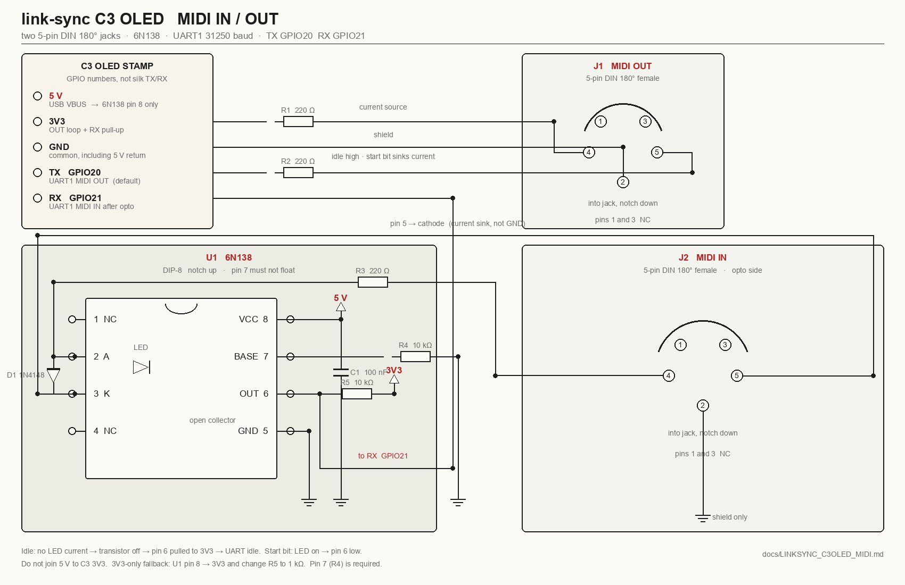

# link-sync C3 OLED — DIN MIDI IN / OUT

Print this page. Same circuit as CrowPanel / P4 (2× DIN + 6N138). No M5
unit. Firmware: UART1 @ 31250, **TX = GPIO20**, **RX = GPIO21** (override
with `--tx-pin` / `--rx-pin`).



Print landscape so the diagram stays on one sheet. ASCII below if the
image does not print.

---

## MCU pins (GPIO numbers, not silk TX/RX)

This stamp’s header spacing crosses the silk labels. Wire **GPIO
numbers**.

| Net | C3 GPIO | Stamp header | Use |
|-----|---------|--------------|-----|
| MIDI OUT (UART TX) | **20** | often silk **RX** | current sink via 220 Ω |
| MIDI IN (UART RX) | **21** | often silk **TX** | 6N138 pin 6 only |
| 3V3 | 3V3 | | OUT loop + RX pull-up |
| GND | GND | | common, including 5 V return |
| 5V | **5V** (USB VBUS) | | 6N138 pin 8 **only** — never a GPIO |

Leave GPIO 5/6 (OLED), 8 (LED), 9 (BOOT), 18/19 (USB) alone.

Flash override:

```bash
./scripts/flash_linksync-c3oled.sh --tx-pin 20 --rx-pin 21
```

---

## BOM

| Qty | Ref | Value | Notes |
|-----|-----|-------|-------|
| 1 | J1 | 5-pin DIN 180° female | MIDI **OUT** |
| 1 | J2 | 5-pin DIN 180° female | MIDI **IN** |
| 1 | U1 | 6N138 DIP-8 | Socket it |
| 2 | R1, R2 | 220 Ω ¼ W | OUT. 180–270 Ω is fine |
| 1 | R3 | 220 Ω ¼ W | IN anode |
| 1 | R4 | 10 kΩ | U1 pin 7 → GND. Not optional |
| 1 | R5 | 10 kΩ | U1 pin 6 → **3V3**. Use **1 kΩ** only if U1 VCC is 3.3 V |
| 1 | D1 | 1N4148 | Reverse across IN LED |
| 1 | C1 | 100 nF | U1 pin 8 to GND, tight to the chip |
| 1 | C2 | 10 µF (optional) | 5 V bulk |
| 1 | | 8-pin DIP socket | |
| | | Hookup | 5V, 3V3, GND, GPIO20, GPIO21 |

No 74HC14, no hardware thru, no activity LED.

---

## DIN numbering

Looking **into** the female jack, notch down:

```
    1     3          NC      NC
  4    2    5        +    shield    −
     notch
```

- Pin **4** = MIDI +
- Pin **5** = MIDI −
- Pin **2** = shield (centre pin)
- Pins **1** and **3** = no connect

Solder cups on the back are **mirrored**. Beep cup → hole.

---

## MIDI OUT (J1) — no opto

UART idle-high, 31250 8N1. 3.3 V current loop is enough for a modern
synth opto.

```
C3 3V3     ── R1 220 Ω ── J1 pin 4     MIDI +
C3 GPIO20  ── R2 220 Ω ── J1 pin 5     MIDI −
C3 GND     ───────────── J1 pin 2     shield
J1 pins 1, 3 NC
```

Idle TX is high, so the loop is off until a start bit pulls TX low and
current flows. That is MIDI Association **Type A**.

If the synth is silent, swap 4 and 5 on **J1 only** (Type B). Leave IN
as drawn.

---

## MIDI IN (J2) — 6N138

Do not solder DIN to GPIO21. A MIDI loop is not 3.3 V UART.

```
                    6N138 DIP-8, notch up

 5V ──┬── U1 pin 8 VCC
      C1 100 nF
 GND ─┴── U1 pin 5 GND
              U1 pin 7 ── R4 10 kΩ ── GND     ← do not float

 J2 pin 4 ── R3 220 Ω ── U1 pin 2 (anode)
 J2 pin 5 ────────────── U1 pin 3 (cathode)
 J2 pin 2 ── GND (shield only — not in the LED loop)
 D1 1N4148: cathode on pin 2, anode on pin 3

 U1 pin 6 (OC) ──┬── R5 10 kΩ ── 3V3
                 └── GPIO21
 U1 pins 1, 4 NC.  J2 pins 1, 3 NC.
```

```
 6N138 top view, notch up

   1 NC          8 VCC     ← 5 V
   2 A           7 Base    ← R4 10 kΩ to GND
   3 K           6 OUT     ← GPIO21 + R5 to 3V3
   4 NC          5 GND
```

Idle MIDI = no LED current = transistor off = pin 6 pulled high = UART
idle. A start bit lights the LED, pin 6 falls.

**5 V is for pin 8 only.** Pin 6 pull-up must be **3V3** so the C3 never
sees 5 V. Stamp 5V is USB VBUS — common GND with the MCU. Never join 5 V
to 3V3.

3.3 V on pin 8 is out of spec (too slow at 31250). Fallback only: jumper
pin 8 to 3V3 and change **R5 to 1 kΩ**. If IN is garbled, give it real
5 V.

---

## Layout

- Star GND at U1 pin 5: IN shield, OUT shield, MCU GND, 5 V return.
- R1/R2 within a couple of centimetres of J1.
- R3 / D1 / U1 next to J2.
- Socket the 6N138.
- 5 V and 3V3 never meet except through R5.

---

## Bring-up

Firmware emits **24 PPQN + Start / Stop / Continue** on GPIO20 only while
transport is **playing** (long-press BOOT). IN Start/Continue → play,
Stop → stop.

| Symptom | Check |
|---------|--------|
| OUT silent | Wrong jack, Type B synth (swap J1 pin 4/5), transport stopped |
| IN silent | No 5 V on U1 pin 8, pin 7 floating, swap J2 pin 4/5 only |
| IN garbled | 6N138 on 3.3 V — use 5 V on pin 8 |
| C3 dies / USB dies | 5 V shorted onto GPIO or 3V3 |

Two separate jacks. Do not jumper OUT 4/5 onto IN.

Regenerate the diagram:

```bash
python3 adapters/c3oled-midi-din/render_schematic.py
```
