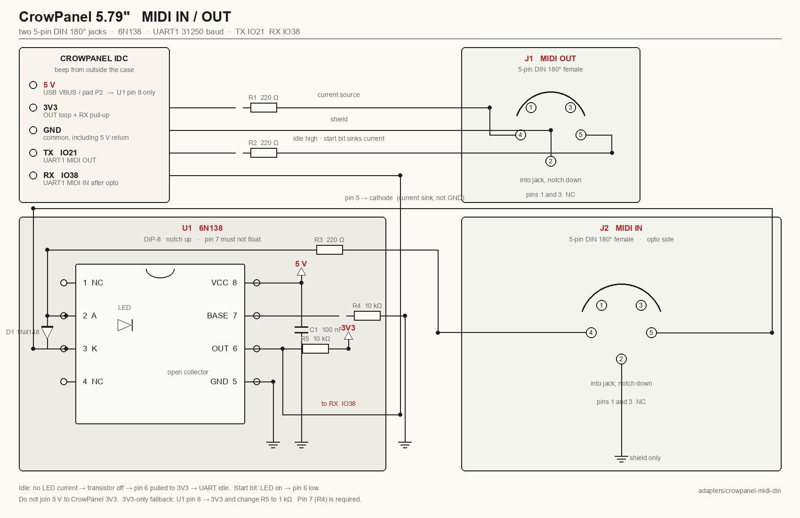

# Elecrow CrowPanel 5.79" e-paper — adapters

Shop notes for the **DIS08792E** CrowPanel (ESP32-S3-WROOM-1-N8R8,
dual SSD1683, 792×272). Firmware profile:
`CONFIG_NEON_BOARD_LINKSYNC_EPD`. Isolated build: `build-linksync-epd/`,
ESP-IDF v5.3.2. Console is the CH343 on USB-C
(`/dev/cu.usbserial-210` here, MAC `1c:db:d4:55:c4:a8`).

The only I/O without opening the case is the **2×10 2.54 mm IDC** on
the bottom. This file is the adapter bible for that header: MIDI IN/OUT
on two 5-pin DIN jacks + a 6N138, TRS, USB-MIDI pigtails, and what the
glass can and cannot tell you about the battery.

Related: [LINKSYNC_EPD.md](LINKSYNC_EPD.md) (firmware / panel rules),
[LINKSYNC_EPD_IDC.md](LINKSYNC_EPD_IDC.md) (short IDC cheat sheet),
[adapters/crowpanel-midi-din](../adapters/crowpanel-midi-din/README.md)
(schematic PNG + BOM).

Do **not** put 5 V on a CrowPanel 3V3 pin.

---

## IDC pinout

Silkscreen on the **PCB component side** (inside the case):

```
IO8   IO3
IO14  IO9
IO16  IO15
IO18  IO17
IO20  IO19     ← S3 USB D+ / D−. Leave free for a native USB-MIDI pigtail.
IO38  IO21     ← MIDI RX (opto) / MIDI TX
3V3   GND
3V3   GND
3V3   GND
```

From **outside** the case the two columns are mirrored. Do not trust
ribbon-cable pin 1 from a photo. Beep **IO21** and **IO38** to the
silkscreen once (four corner screws). Any 3V3 / GND pair is fine. TX
and RX sit on the same row.

| Leave alone | Why |
|-------------|-----|
| IO3 | JTAG strap. Free ADC later if you jumper a BAT divider. |
| IO4 | Rotary NEXT — not on this header, never UART. |
| IO19 / IO20 | Native USB D− / D+ |
| IO45–48, 11, 12, 7 | e-paper |

Firmware (`board_pins.h`, `CONFIG_NEON_BOARD_LINKSYNC_EPD`):

| Function | GPIO |
|----------|------|
| MIDI TX (UART1, 31250, idle-high) | **21** |
| MIDI RX (UART1, after an opto) | **38** |
| USB-present sense (CH340 / UART0 RX, do not remux) | **44** |
| Key up / down / top / bot / OK | 4 / 6 / 1 / 2 / 5 |

Keys are active-low with pull-ups, on the left edge of the panel, not
the IDC.

---

## MIDI OUT (J1) — no opto

UART MIDI out, idle-high, 31250 8N1. 3.3 V is enough for a modern
synth opto. Two 220 Ω (180–270 Ω is fine).

```
CrowPanel 3V3  ── R1 220 Ω ── DIN pin 4     TRS-A ring / TRS-B tip
CrowPanel IO21 ── R2 220 Ω ── DIN pin 5     TRS-A tip  / TRS-B ring
CrowPanel GND  ───────────── DIN pin 2      sleeve
```

Idle TX is high, so the loop is off until a start bit pulls TX low and
current flows. Pins 1 and 3 are no-connect.

This is what leaves the box: Link-derived **24 PPQN + Start/Stop**.
Settings → MIDI CLK ON. The glass does not tick.

---

## MIDI IN (J2) — 6N138

A MIDI current loop is **not** 3.3 V UART. Do not solder a DIN or TRS
straight to IO38.

The 6N138 Darlington is specified at **4.5–20 V**. The CrowPanel
header has no 5 V. Run pin 8 from **USB 5 V** (common GND) and pull
the open-collector output up to **3V3** so the S3 never sees 5 V.



```
                    6N138 DIP-8, notch up                 J2 MIDI IN
 5V ──┬── pin 8 VCC
      C1 100 nF
 GND ─┴── pin 5 GND
              pin 7 ── R4 10 kΩ ── GND     (do not float)

 J2 pin 4 ── R3 220 Ω ── pin 2 (anode)
 J2 pin 5 ────────────── pin 3 (cathode)
 J2 pin 2 ── GND (shield only — not in the loop)
 D1 1N4148: cathode on pin 2, anode on pin 3

 pin 6 (OC) ──┬── R5 10 kΩ ── 3V3
              └── IO38
 pins 1, 4 NC. J2 pins 1, 3 NC.
```

```
 6N138 top view, notch up

   1 NC          8 VCC     ← 5 V (or 3V3 fallback)
   2 A           7 Base    ← R4 10 kΩ to GND
   3 K           6 OUT     ← IO38 + R5 to 3V3
   4 NC          5 GND
```

Idle MIDI = no LED current = transistor off = pin 6 pulled high =
UART idle. A start bit lights the LED, pin 6 falls.

### 5 V for pin 8

GND common with the CrowPanel. Never join 5 V to 3V3.

1. Spare USB-A charger / power bank: +5 to pin 8, − to GND.
2. USB-C already in the panel: four screws, VBUS is test pad **P2**
   next to the USB jack. One wire.
3. 3.3 V fallback: jumper pin 8 to 3V3, change **R5 to 1 kΩ**, keep
   R4. Out of spec. If IN is garbled, give it real 5 V.

### What IN does

Start / Continue → PLAYING. Stop → STOPPED. Incoming clock is
**ignored** (`clock_policy = kIgnore`). This box still *emits*
Link-derived 24 PPQN on OUT.

---

## DIN numbering

Looking **into** the female jack, notch down:

```
    1     3
  4    2    5
     notch
```

Solder cups on the back are mirrored. Beep cup → hole.

---

## BOM (2× DIN + 6N138)

| Ref | Value | Notes |
|-----|-------|-------|
| J1 | 5-pin DIN 180° female | MIDI **OUT** |
| J2 | 5-pin DIN 180° female | MIDI **IN** |
| U1 | 6N138 | DIP-8. Socket it. |
| R1, R2, R3 | 220 Ω ¼ W | 180–270 Ω is fine |
| R4 | 10 kΩ | pin 7 → GND. Required. |
| R5 | 10 kΩ (5 V VCC) / **1 kΩ** (3.3 V VCC) | pin 6 pull-up to 3V3 |
| D1 | 1N4148 | reverse across the LED |
| C1 | 100 nF | pin 8 to GND, tight to the chip |
| C2 | 10 µF (optional) | 5 V bulk |
| | 8-pin DIP socket | |
| | 1×5 Dupont | `5V  3V3  GND  TX  RX` |
| | 2×10 2.54 mm male-to-Dupont | IDC harness |

Keep R1/R2 next to J1, R3/D1/U1 next to J2. Star-GND at U1 pin 5:
shield, CrowPanel GND, USB 5 V return. 5 V and 3V3 meet only through R5.

---

## ittybittymidi (instead of soldering the DIP)

The **active** IBM (coin cell, power switch, activity LED) is already
a 6N138 MIDI IN. Passive IBM is AC-coupled for pikocore clock pins —
not a UART.

```
controller MIDI OUT ── DIN or TRS-A ── IBM input

IBM output jack (facing away from the DIN):
  tip    → CrowPanel IO38
  sleeve → CrowPanel GND
  ring     (tied to sleeve on the IBM — leave it)
```

Switch on, common ground, do not feed IBM VSYS into 3V3.

---

## TRS-A / TRS-B

Same two 220 Ω as DIN OUT. Settings menu **TRS A/B** is that
reminder, not a pin mux.

| TRS | DIN | Type A (MMA) | Type B (old Korg) |
|-----|-----|--------------|-------------------|
| tip | 5 / 4 | IO21 via 220 Ω | 3V3 via 220 Ω |
| ring | 4 / 5 | 3V3 via 220 Ω | IO21 via 220 Ω |
| sleeve | 2 | GND | GND |

A DPDT on tip/ring makes one jack do both. Off-the-shelf Type-A
DIN↔TRS dongles only help *after* you have a DIN.

If OUT is silent, swap DIN 4/5 on **J1 only**. If IN is silent, no 5 V,
pin 7 floating, or swap DIN 4/5 on **J2 only**.

---

## USB MIDI

The CrowPanel USB-C is **CH343 UART0** (console / flash). It will not
enumerate as a MIDI device.

- Hear clock in a DAW this week: J1 DIN → any USB-MIDI interface.
- Stamp S3 / RP2040 USB-OTG: [stamps3-usb-midi](../adapters/stamps3-usb-midi/README.md)
  (IO21 → G1), [rp2040-usb-midi](../adapters/rp2040-usb-midi/README.md)
  (IO21 → Pico GP1).
- Native USB-MIDI from this box later: TinyUSB + pigtail IO19 = D−,
  IO20 = D+, GND. Board still powered from its own USB-C. Do not feed
  VBUS into 3V3.

---

## Battery / charging

BAT is a 3.7 V LiPo (1100 mAh is fine). Onboard DFN8_4054A (TP4054)
charges from USB VBUS. Elecrow's schematic:

- BAT = connector, 4054, PMOS load-share, test pad **P5**. No divider
  onto an ADC GPIO.
- 4054 **CHRG** (GHRG) is unconnected. IO41 is the POWER LED *output*.

There is no honest % or millivolt reading. The glass shows a **battery
+ bolt** top-right while USB is present: the CH340 is VBUS-powered, so
UART0 RX (GPIO44) sits idle-high only while the cable is in. Unplug
onto the pack, the icon drops on the next ambient refresh (~5 s).

USB-C PD with the pack already connected can leave VBUS ~2 V and
fail Mac serial. USB-A → C, or USB-first, charges. Do not desolder
the pack to “fix” that.

Fuel gauge later: 100 kΩ / 100 kΩ from P5 to header **IO3** (ADC1_CH2)
and GND. Firmware does not assume that jumper.

---

## Glass

- No full-width black bars at the top/bottom (they vanish into a dark
  bezel).
- Partial refresh (SSD1683 mode 0xFF) for BPM nudge, menu cursor,
  value edits. Full refresh (0xF7) on splash → live, live → settings,
  invert, and every 20 partials. 30 s idle → panel sleep.
- Splash on boot / restart / power-off: NEON LINK, “press the 2 side
  buttons to start.” Chord the two side keys to enter live.
- Dual-press again for inverted settings. Bot long (3 s) → Restart /
  Power Off / Cancel.

---

## Bring-up

1. Dupont harness in the IDC. Meter 3V3 and GND. Beep IO21 and IO38.
2. J1 OUT + two 220 Ω. DIN into a synth, or DIN → USB-MIDI → Mac.
3. Join the SoftAP printed on the glass (`LINK-EPD-C4A8` /
   `link-55C4A8` on this unit — physical access is the credential).
4. Play from Live. 24 PPQN + Start/Stop on the synth. Glass will not
   tick.
5. J2 IN (6N138 + 5 V, or active IBM). Controller Start → PLAYING.

Flash (isolated, will not clobber P4 / Tab5 sdkconfig):

```bash
./scripts/flash_linksync-epd.sh /dev/cu.usbserial-210
```

Rebuild only:

```bash
idf.py -B build-linksync-epd \
  -DSDKCONFIG=build-linksync-epd/sdkconfig \
  -DSDKCONFIG_DEFAULTS="sdkconfig.defaults;sdkconfig.defaults.linksync-epd" \
  build
```
